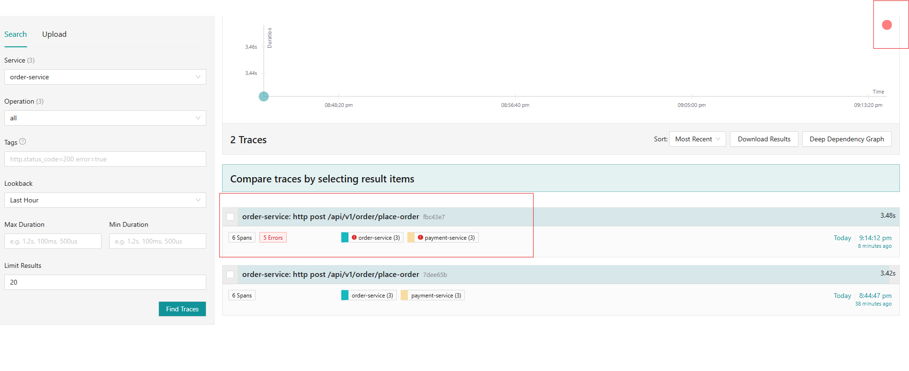
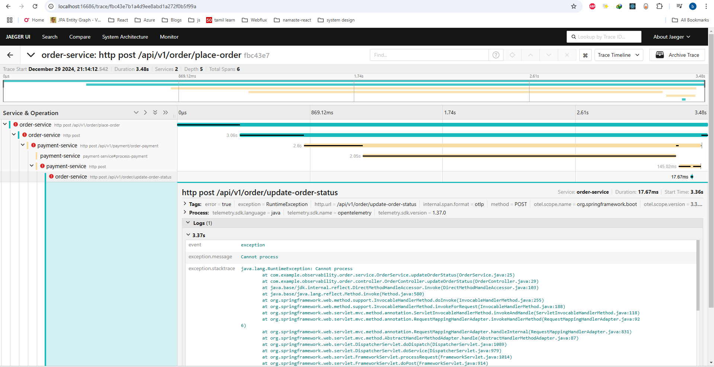

Sample API
`http://localhost:8081/api/v1/order/place-order`
```json
{
    "id": 1,
    "paymentToken": "some-token",
    "orderStatus": "PLACED",
    "items": [{
        "productId": 123,
        "quantity": 2
    }]
}
```
1. Intentionally thrown exception to see ui in jaeger


When expand to details then saw:
Notice in below image how logs are displayed for errors and in sequential image, we can see time of running
